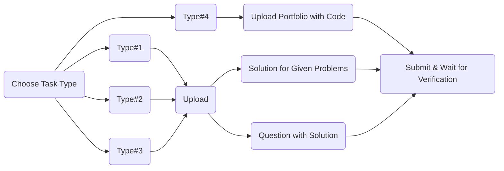

# HackElite

HackElite is a repository created & maintained by DevNation, coding community at AJIET, this is open to all & everyone irrespective of your coding levels.

## How It Works

Flow-chart representing how this repo. works :

_Note:_
_When Uploading & Submitting Pull Requests you need to submit it within a folder & the folder name must be your GitHub Username_

## How To Contribute

We welcome all contributions, suggestions & ideas for improvement from the community.
You can contribute by posting in the Solutions folder in Problem Type of your choice.

There are 4 Types of Tasks, those are as follows:

**Type#1:**

- Type#1 consist of various code snippets that are almost correct but have some errors or missing parts.
- You can contribute to this task either by uploading different problems that are similar in nature as well as the corresponding solution or by uploading solutions for given problems.

**Type#2:**

- Type#2 consists of competitive programming sums.
- You can contribute for this either by uploading more questions related to competitive programming as well as the respective solutions or by uploading solutions for the given problems.

**Type#3:**

- Type#3 consist of designing UI represented by the given images.
- You can contribute for this either by uploading your own UI images along with appropriate code or by uploading solutions for the given tasks.

**Type#4:**

- Type#4 is a folder to upload various kinds of portfolio websites.
- You can contribute by uploading your portfolio website screenshots along with code.
